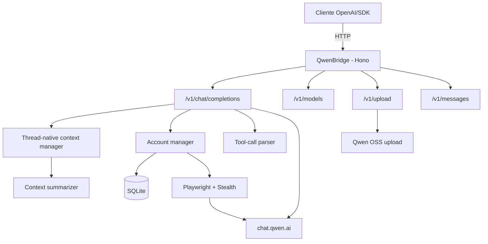

# QwenBridge — Custom Version

> Fork mantido por **[@deivid22srk](https://github.com/deivid22srk)** — repositório oficial: **https://github.com/deivid22srk/QwenBridge-Custom-Version**
>
> Fork upstream original: https://github.com/AnThophicous/QwenBridge-Custom-Version

API compatível com OpenAI que conecta clientes ao **Qwen (`chat.qwen.ai`)** com suporte a múltiplas contas, tool calling robusto, uploads multimodais e sessões persistentes. Inclui modo Playwright com stealth para evasão de anti-bot, rotação com cooldown, variantes `-no-thinking`, sumarização de contexto, cache comprimido, observabilidade e **retry automático para erros de quota do Qwen upstream** (`quota_limit`, "alta demanda", "Tente novamente mais tarde").

[](https://www.typescriptlang.org/)
[](https://hono.dev/)
[](LICENSE)
[](https://github.com/deivid22srk/QwenBridge-Custom-Version)

---

## Principais funcionalidades

- **Compatibilidade OpenAI** — Endpoints `/v1/chat/completions`, `/v1/models`, `/v1/chat/completions/stop` e `/v1/upload`.
- **Compatibilidade Anthropic** — Endpoint `/v1/messages` para SDKs Anthropic.
- **Playwright com stealth** — Captura de headers reais (`bx-ua`, `bx-umidtoken`) por conta com `playwright-extra` e `puppeteer-extra-plugin-stealth`.
- **Anti-bot retry** — Detecção automática de `FAIL_SYS_USER_VALIDATE`/`RGV587_ERROR` com retry e rotação de conta.
- **Quota retry (novo neste fork)** — Detecta `quota_limit`, `quota_exceeded`, `RateLimited`, "alta demanda", "Tente novamente mais tarde" (EN e PT-BR) e faz retry automático com backoff exponencial + rotação de conta.
- **Adicionar contas em lote (novo neste fork)** — Opção `[B]` no `npm run login` para colar várias contas de uma vez (email/senha em linhas separadas, `email:senha`, `email senha` ou formato `.env`).
- **Dynamic timeouts** — Timeout baseado no tamanho do payload (`120s + 30s/MB`).
- **Payload size limit** — Validação de tamanho (10MB) antes de enviar ao Qwen.
- **Modelos Qwen atuais** — Funciona com a família `qwen3.x` e expõe variantes sintéticas `-no-thinking`.
- **Múltiplas contas** — Rotação round-robin, cooldown automático e inicialização paralela.
- **Persistência de sessão** — Cookies/JWT do Qwen persistidos por conta no SQLite.
- **Uploads multimodais** — Imagens, vídeo, áudio e documentos enviados ao OSS do Qwen.
- **Tool calling robusto** — Parser tolerante a stream fragmentado, JSON malformado e blocos XML/Hermes-style.
- **Gerenciamento de contexto** — Truncamento, sumarização, detecção de tópico e preservação de sessão.
- **Cache com compressão Brotli** — TTL em memória, métricas e serialização segura.
- **Observabilidade** — `/health`, `/metrics`, watchdog e métricas Prometheus.
- **Deploy simples** — `npm`, Docker e graceful shutdown.

---

## Arquitetura



---

## Autenticação

QwenBridge usa Playwright por padrão e de forma exclusiva. Cada conta configurada abre uma sessão real de browser para capturar cookies e headers anti-bot (`bx-ua`, `bx-umidtoken`, `bx-v`).

```env
PLAYWRIGHT_HEADLESS=true
PLAYWRIGHT_BROWSER=chromium
```

**Requisitos:**
```bash
npx playwright install chromium
```

---

## Modelos e contexto

Os modelos e janelas de contexto são sincronizados automaticamente via `/v1/models`.
Valores hardcoded como fallback antes da primeira chamada à API:

| Modelo | Contexto | Divisor de tokens |
|---|---|---|
| `qwen3.7-plus` | 1.000.000 | 2.0 |
| `qwen3.7-max` | 1.000.000 | 2.2 |
| `qwen3.6-plus` | 1.000.000 | 2.0 |
| `qwen3.6-plus-preview` | 1.000.000 | 2.0 |
| `qwen3.5-plus` | 1.000.000 | 2.0 |
| `qwen3.5-flash` | 1.000.000 | 1.8 |
| `qwen3-coder-plus` | 1.048.576 | 2.3 |
| `qwen3.6-max-preview` | 262.144 | 2.2 |
| `qwen3.5-max-2026-03-08` | 262.144 | 2.2 |
| `qwen3-vl-plus` | 262.144 | 2.1 |
| `qwen3.5-omni-plus` | 262.144 | 1.8 |
| `qwen3-omni-flash-2025-12-01` | 65.536 | 1.7 |
| `qwen-plus-2025-07-28` | 131.072 | 2.0 |
| **Fallback** | **131.072** | **2.0** |

### Variantes `-no-thinking`

Todos os modelos acima possuem variantes `-no-thinking` (ex: `qwen3.7-plus-no-thinking`).
Usa a mesma janela de contexto do modelo base.

---

## Pré-requisitos

| Dependência | Versão mínima | Observação |
|---|---:|---|
| Node.js | 20+ | Recomendado usar LTS |
| npm | 9+ | Incluído com Node |
| Playwright | - | Para modo Playwright (`npx playwright install chromium`) |
| Docker | opcional | Para deploy em container |

---

## Instalação

### Via npm

```bash
git clone https://github.com/deivid22srk/QwenBridge-Custom-Version.git
cd QwenBridge-Custom-Version
npm install
npx playwright install chromium  # Se usar Playwright
```

### Via Docker

```bash
docker-compose up -d
```

---

## Início rápido

Crie um `.env` na raiz. O `.env.example` contém a lista completa das opções suportadas pelo fork.

### Exemplo mínimo

```env
QWEN_ACCOUNTS=user1@example.com:senha1;user2@example.com:senha2
```

> **Dica:** Use `;` como separador preferencial de contas para evitar conflito com `,` em senhas.
> O formato legado com `,` continua aceito.
> Senhas com `:`, `#`, espaços e outros caracteres especiais funcionam normalmente.

### Adicionar contas via CLI interativo

```bash
npm run login
```

Menu disponível:

| Opção | Descrição |
|---|---|
| `[A]` | Adicionar uma conta existente (email + senha) |
| `[B]` | **Adicionar várias contas em lote** — cole as contas de uma vez |
| `[C]` | Criar contas automaticamente (mail.tm + captcha) |
| `[R]` | Remover conta |
| `[Q]` | Sair |

#### Como usar a opção `[B]` (lote)

Selecione `[B]` no menu e cole as contas no formato que preferir. **Todos os formatos abaixo são aceitos** (podem ser misturados no mesmo paste):

**Formato 1 — Email na linha 1, senha na linha 2 (um par por conta):**

```
Exemplo1@gmail.com
Exemplosenha1

Exemplo2@gmail.com
Exemplosenha2

Exemplo3@gmail.com
Exemplosenha3
```

**Formato 2 — `email:senha` por linha:**

```
Exemplo1@gmail.com:Exemplosenha1
Exemplo2@gmail.com:Exemplosenha2
Exemplo3@gmail.com:Exemplosenha3
```

**Formato 3 — `email senha` (separados por espaço/tab):**

```
Exemplo1@gmail.com Exemplosenha1
Exemplo2@gmail.com Exemplosenha2
```

**Formato 4 — Estilo `.env` (uma única linha):**

```
Exemplo1@gmail.com:Exemplosenha1;Exemplo2@gmail.com:Exemplosenha2;Exemplo3@gmail.com:Exemplosenha3
```

**Regras:**
- Linhas em branco entre contas são ignoradas.
- Linhas começadas com `#` são tratadas como comentário.
- Senhas com `:`, `;`, `#`, espaços funcionam normalmente (desde que o formato escolhido não use esses caracteres como separador).
- Após colar, pressione **Enter duas vezes** em linha vazia (ou digite `END` / `DONE`) para finalizar a entrada.
- O sistema mostra um resumo (`ok`/`skip`/`fail`) antes de confirmar a importação. Contas que já existem são marcadas como `skip` (não causam erro).

### Iniciar

```bash
npm start
```

---

## Testes

```bash
npm test           # Todos
npm run test:mock  # Só mocks
npm run test:live  # Só reais/live
```

---

## Variáveis de ambiente

### Rede e segurança

| Variável | Default | Descrição |
|---|---|---|
| `PORT` | `3000` | Porta HTTP do proxy. |
| `HOST` | `0.0.0.0` | Host de bind. Para uso local, `127.0.0.1`. |
| `API_KEY` | vazio | Protege rotas `/v1/*` com `Authorization: Bearer ...`. |
| `ALLOW_UNAUTHENTICATED` | `false` | Permite `API_KEY` vazio em `NODE_ENV=production` com `HOST=0.0.0.0`. Use apenas em ambiente isolado. |

### Autenticação e sessão

| Variável | Default | Descrição |
|---|---|---|
| `QWEN_ACCOUNTS` | vazio | Contas no formato `email1:senha1;email2:senha2`. Use `;` como separador (`,` como fallback legacy). Senhas com `:`, `#`, espaços funcionam normalmente. |
| `DELETE_ALL_CHATS_ON_SHUTDOWN` | `false` | Limpa chats no shutdown. |

### Playwright

| Variável | Default | Descrição |
|---|---|---|
| `PLAYWRIGHT_HEADLESS` | `true` | Browser headless (sem janela). |
| `PLAYWRIGHT_BROWSER` | `chromium` | Navegador: `chromium`, `chrome`, `edge`. |
| `PLAYWRIGHT_INIT_BATCH_SIZE` | `1` | Quantas contas inicializar em paralelo no startup. Use baixo para evitar pico de RAM. |
| `PLAYWRIGHT_CONTEXT_CLOSE_TIMEOUT_MS` | `10000` | Timeout para fechar contexto/browser antes do kill best-effort. |
| `PLAYWRIGHT_IDLE_CONTEXT_TTL_MS` | `600000` | Fecha contextos Playwright ociosos após esse tempo (`0` desativa). |
| `SESSION_KEEP_ALIVE_ENABLED` | `false` | Mantém sessões ativas com atividade leve apenas quando a conta está ociosa. Opt-in para evitar Chromes permanentes. |
| `SESSION_KEEP_ALIVE_INTERVAL_MS` | `180000` | Intervalo entre ciclos de keep-alive/limpeza. |
| `SESSION_KEEP_ALIVE_IDLE_MS` | `120000` | Tempo mínimo sem uso antes de uma conta ser elegível ao keep-alive. |
| `SESSION_KEEP_ALIVE_NAVIGATION_INTERVAL_MS` | `480000` | Intervalo mínimo para navegação leve de validação durante keep-alive. |

### Headers anti-bot

| Variável | Default | Descrição |
|---|---|---|
| `USER_AGENT` | Chrome 149 Windows | User-Agent fallback para Playwright/downloads. |
| `QWEN_BX_V` | `2.5.36` | Versão `bx-v` fallback; `bx-ua` e `bx-umidtoken` são capturados do browser. |

O Playwright também aplica um fingerprint estável por conta (UA Chrome 149, locale, viewport, hardware e WebGL coerentes) para reduzir inconsistências sem trocar a arquitetura thread-native/tools do fork.

### Delays e retry

| Variável | Default | Descrição |
|---|---|---|
| `RETRY_BASE_DELAY_MS` | `1000` | Delay base para retries (exponential backoff). |
| `RETRY_MAX_DELAY_MS` | `10000` | Cap do exponential backoff. |
| `ANTI_BOT_BASE_DELAY_MS` | `5000` | Delay base para erros anti-bot. |
| `ANTI_BOT_MAX_DELAY_MS` | `30000` | Cap do exponential backoff anti-bot. |
| `QUOTA_RETRY_MAX_ATTEMPTS` | `5` | Número máximo de tentativas quando o upstream retorna `quota_limit` / "alta demanda" / "Tente novamente mais tarde". |
| `QUOTA_RETRY_BASE_DELAY_MS` | `2000` | Delay base (ms) para o backoff exponencial entre tentativas de quota. |
| `QUOTA_RETRY_MAX_DELAY_MS` | `30000` | Cap (ms) do backoff exponencial de quota. |
| `ACCOUNT_COOLDOWN_MS` | `60000` | Cooldown padrão (Qwen sobrescreve quando informa tempo). |
| `CAPTCHA_MAX_RETRIES` | `3` | Número máximo de tentativas do captcha solver no fluxo HTTP+WAF (Aliyun). |
| `CAPTCHA_UI_FALLBACK_MAX_ATTEMPTS` | `10` | Número máximo de tentativas no fluxo UI fallback (Playwright form fill). Maior que o HTTP porque já é um caminho lento. |
| `CAPTCHA_F008_COOLDOWN_MS` | `900` | Cooldown (ms) entre tentativas após receber `F008` do Aliyun (IP/token throttle). Aumente se estiver atrás de um IP só. |
| `CAPTCHA_RETRY_COOLDOWN_MS` | `400` | Cooldown (ms) entre tentativas para códigos diferentes de `F008` (`F015`, `F001`, etc.). |

### Sessão expirada e re-login

| Variável | Default | Descrição |
|---|---|---|
| — (hardcoded) | `15 min` | Cooldown aplicado a uma conta quando o re-login falha após `QwenSessionExpiredError`. Use `npm run login` para renovar manualmente as credenciais. |

> **Detecção de sessão expirada (PT-BR):** o proxy detecta automaticamente mensagens do Qwen como *"Você não tem permissão para acessar este recurso. Por favor, entre em contato com o seu administrador para obter assistência."* e as classifica como `QwenSessionExpiredError` (em vez de `QwenUpstreamError` 502). Isso dispara o fluxo de re-login automático e, se ele falhar, marca a conta com cooldown de 15 min para evitar loop infinito na mesma conta quebrada.

### Timeouts

| Variável | Default | Descrição |
|---|---|---|
| `HTTP_TIMEOUT` | `10000` | Timeout HTTP genérico. |
| `TOTAL_REQUEST_TIMEOUT` | `300000` | Timeout máximo de geração. |
| `REASONING_MODEL_TIMEOUT` | `600000` | Timeout para modelos com reasoning. |

**Nota:** Timeouts são dinâmicos: `120s + 30s por MB de payload`.

### Cache

| Variável | Default | Descrição |
|---|---|---|
| `CACHE_TTL` | `3600` | TTL do cache em segundos. |
| `CACHE_COMPRESSION_ENABLED` | `true` | Compressão Brotli. |

### Contexto

| Variável | Default | Descrição |
|---|---|---|
| `CONTEXT_SUMMARIZATION_ENABLED` | `true` | Sumarização do contexto thread-native. |
| `CONTEXT_SUMMARIZATION_MODEL` | `qwen3.5-flash` | Modelo para sumarização. |

### Observabilidade

| Variável | Default | Descrição |
|---|---|---|
| `METRICS_INTERVAL` | `10000` | Intervalo de métricas. |
| `WATCHDOG_INTERVAL` | `5000` | Intervalo do watchdog. |
| `RAM_WARNING` | `80` | % RAM para warning. |
| `RAM_CRITICAL` | `95` | % RAM para critical. |

---

## Anti-bot e Quota

O QwenBridge detecta automaticamente erros de anti-bot e de quota:

- **Anti-bot:** `FAIL_SYS_USER_VALIDATE`, `RGV587_ERROR`
- **Quota:** `quota_limit`, `quota_exceeded`, `RateLimited`, `Allocated quota exceeded`, `token-limit`, `insufficient quota`, `rate limit`, e mensagens em português como "O serviço está com alta demanda no momento. Tente novamente mais tarde.", "alta demanda", "tente novamente", "cota excedida".

**Fluxo:**
1. Erro detectado → retry com delay exponencial + jitter (até `QUOTA_RETRY_MAX_ATTEMPTS` tentativas)
2. Cada retry marca a conta atual como em cooldown e tenta uma conta diferente
3. Todas as tentativas falham → erro retornado ao cliente

**Com Playwright:** Cada conta tem seu próprio fingerprint (`bx-ua`, `bx-umidtoken`) capturado do browser real.

---

## Endpoints

### OpenAI Compatible

| Rota | Método | Descrição |
|---|---|---|
| `/v1/chat/completions` | POST | Chat completions (streaming + non-streaming) |
| `/v1/chat/completions/stop` | POST | Abortar geração ativa |
| `/v1/models` | GET | Listar modelos |
| `/v1/models/:id` | GET | Modelo específico |

### Anthropic Compatible

| Rota | Método | Descrição |
|---|---|---|
| `/v1/messages` | POST | Mensagens (formato Anthropic) |
| `/v1/messages/count_tokens` | POST | Contar tokens |

### Utilidades

| Rota | Método | Descrição |
|---|---|---|
| `/health` | GET | Health check |
| `/metrics` | GET | Métricas Prometheus |
| `/v1/upload` | POST | Upload de arquivos |

---

## Exemplos de uso

### OpenAI SDK (Node.js)

```typescript
import OpenAI from "openai";

const client = new OpenAI({
  baseURL: "http://localhost:3000/v1",
  apiKey: "sua-api-key",
});

const completion = await client.chat.completions.create({
  model: "qwen3.7-plus",
  messages: [{ role: "user", content: "Hello!" }],
});

console.log(completion.choices[0].message.content);
```

### Anthropic SDK

```typescript
import Anthropic from "@anthropic-ai/sdk";

const client = new Anthropic({
  baseURL: "http://localhost:3000",
  apiKey: "sua-api-key",
});

const message = await client.messages.create({
  model: "qwen3.7-plus",
  max_tokens: 1024,
  messages: [{ role: "user", content: "Hello!" }],
});

console.log(message.content[0].text);
```

### cURL

```bash
curl http://localhost:3000/v1/chat/completions \
  -H "Content-Type: application/json" \
  -H "Authorization: Bearer sua-api-key" \
  -d '{
    "model": "qwen3.7-plus",
    "messages": [{"role": "user", "content": "Hello!"}],
    "stream": true
  }'
```

---

## Tool calling

O parser suporta:
- Tags `<tool_call>` XML
- Formato Hermes-style
- JSON malformado (strings sem aspas, quotes escapadas)
- Stream fragmentado

---

## Anthropic Model Mapping

| Claude Model | Qwen Model |
|---|---|
| `claude-opus-4-*` | `qwen3.7-max` |
| `claude-sonnet-4-*` | `qwen3.7-plus` |
| `claude-haiku-4-*` | `qwen3.5-flash` |
| `claude-3-5-sonnet` | `qwen3.7-plus` |
| `claude-3-opus` | `qwen3.7-max` |
| `claude-3-sonnet` | `qwen3.6-plus` |
| `claude-3-haiku` | `qwen3.5-flash` |

---

## Deploy com Docker

```yaml
services:
  qwenbridge:
    build: .
    container_name: qwenbridge
    ports:
      - "${PORT:-3000}:3000"
    env_file:
      - .env
    volumes:
      - ./data:/app/data
    restart: unless-stopped
    logging:
      driver: "json-file"
      options:
        max-size: "10m"
        max-file: "3"
```

O container ajusta permissões no startup para `data/db` e `data/qwen_profiles`, evitando falhas comuns com volumes bind-mounted.

---

## Estrutura do projeto

```
QwenBridge/
├── src/
│   ├── api/              # Server, models, error helpers
│   ├── cache/            # Memory cache com Brotli
│   ├── core/             # Config, accounts, database, metrics
│   ├── routes/
│   │   ├── anthropic/    # Anthropic API compatible
│   │   └── chat/         # Chat completions, streaming
│   ├── services/
│   │   ├── auth-playwright.ts # Headers Playwright + mock de testes
│   │   ├── playwright.ts      # Playwright + stealth
│   │   └── qwen.ts            # Qwen API integration
│   ├── tools/                 # Tool-call instructions, parser e schema
│   └── utils/                 # JSON parser, token estimation, context summary
├── data/                 # SQLite, encryption key e profiles (gitignored)
├── Dockerfile
├── docker-compose.yml
└── package.json
```

---

## Scripts úteis

| Comando | Descrição |
|---|---|
| `npm start` | Iniciar servidor |
| `npm run login` | Gerenciar contas |
| `npm test` | Rodar todos os testes |
| `npm run test:mock` | Testes com mock |
| `npm run test:live` | Testes reais |
| `npm run typecheck` | Verificar tipos |


---

## Troubleshooting

| Problema | Solução |
|---|---|
| Anti-bot bloqueando | Refaça login da conta e verifique se o Playwright está capturando headers |
| `quota_limit` / "alta demanda" | O retry automático já cobre isso. Se persistir, adicione mais contas via `[B]` no `npm run login` ou aumente `QUOTA_RETRY_MAX_ATTEMPTS` |
| Quota exceeded | Adicione mais contas (use `[B]` no `npm run login` para colar várias de uma vez) ou espere cooldown |
| Timeout em requests grandes | Aumente `TOTAL_REQUEST_TIMEOUT` |
| Playwright não inicia | Execute `npx playwright install chromium` |
| Porta em uso | Altere `PORT` no `.env` |
| Sessão expirada | Execute `npm run login` para renovar |

---

## Sobre este fork

Fork mantido por **[@deivid22srk](https://github.com/deivid22srk)** com foco em resiliência do retry de quota e usabilidade do CLI de contas.

**Melhorias em relação ao upstream:**

1. **Retry automático para `quota_limit`** — O upstream tratava `quota_limit` (e a mensagem PT-BR "alta demanda") como erro 502 definitivo. Este fork detecta esses casos e aplica retry com backoff exponencial (até `QUOTA_RETRY_MAX_ATTEMPTS` tentativas, padrão 5) + rotação de conta.
2. **Adicionar contas em lote** — Nova opção `[B]` no `npm run login` para colar várias contas de uma vez (aceita 4 formatos: par de linhas, `email:senha`, `email senha`, `.env`).
3. **Detecção de sessão expirada PT-BR** — O upstream não reconhecia a mensagem *"Você não tem permissão para acessar este recurso..."* do Qwen e a tratava como erro 502. Este fork classifica corretamente como `QwenSessionExpiredError`, dispara re-login e, se falhar, marca a conta com cooldown de 15 min (motivo `SessionExpired`) para evitar loop infinito na mesma conta quebrada.
4. **Shutdown gracioso durante o batch init** — O upstream só instalava signal handlers APÓS o batch init de Playwright, então Ctrl+C durante o startup matava Chromium abruptamente e produzia erros ruidosos *"Target page, context or browser has been closed"*. Este fork instala signal handlers ANTES do batch e adiciona flag `closingAllPlaywright` checado em `initPlaywrightForAccount` + loop de batches para abortar limpo.
5. **Force-exit timeout no shutdown** — Se `stopServer` pendurar (ex.: mutex Playwright preso), o processo sai em 10s em vez de ficar travado.
6. **Captcha solver configurável** — Novas env vars `CAPTCHA_MAX_RETRIES`, `CAPTCHA_UI_FALLBACK_MAX_ATTEMPTS`, `CAPTCHA_F008_COOLDOWN_MS`, `CAPTCHA_RETRY_COOLDOWN_MS` para ajustar tentativas e cooldowns do solver Aliyun sem recompilar.
7. **README em PT-BR alinhado ao fork** — Sem referências ao repositório `johngbl/QwenBridge` original.

**Veja também:**
- Upstream original: https://github.com/AnThophicous/QwenBridge-Custom-Version
- Issues e PRs bem-vindos: https://github.com/deivid22srk/QwenBridge-Custom-Version/issues

---

## Disclaimer

Este projeto é fornecido para fins educacionais e de pesquisa. Use por sua conta e risco.
